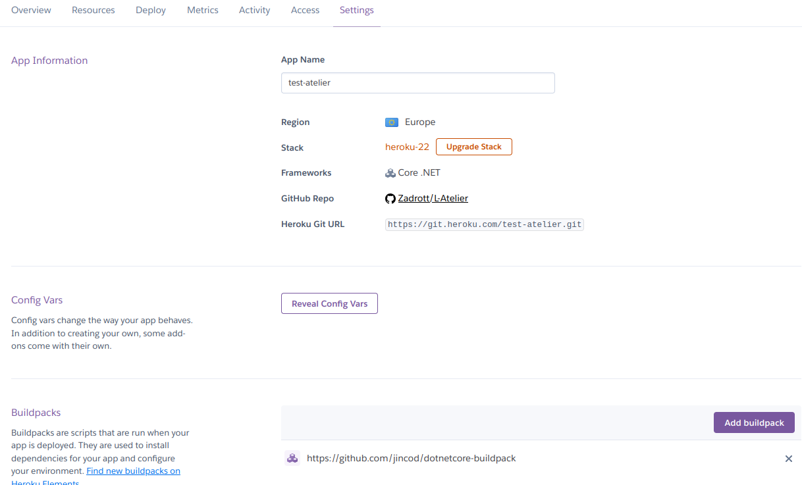
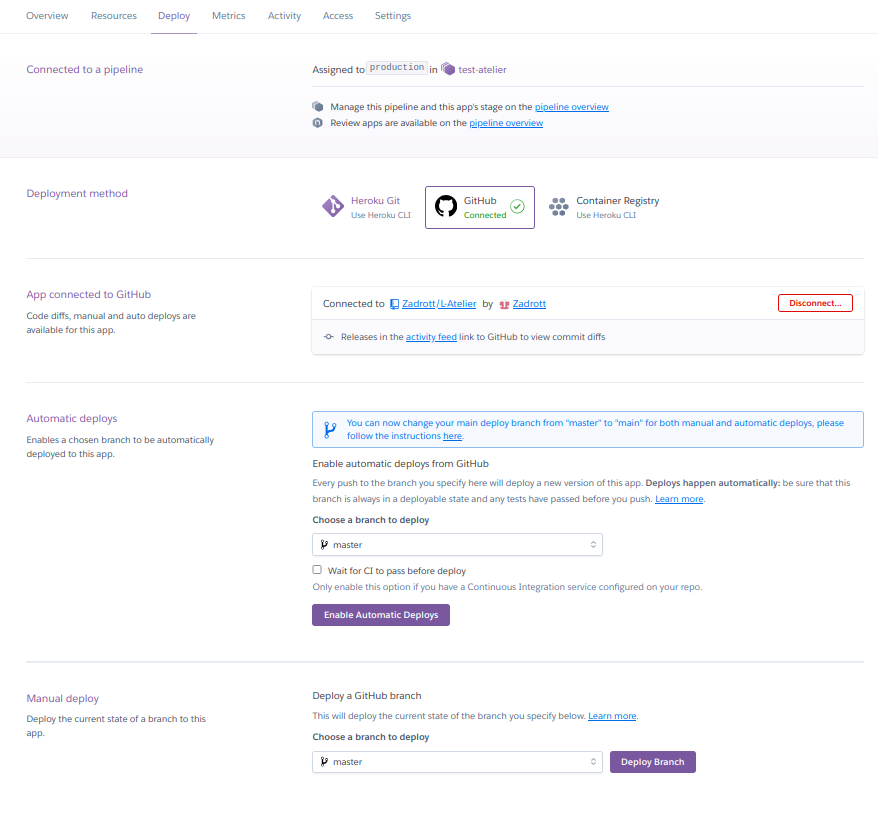

# Test technique L'Atelier - Backend

## Objectif
Créer une API simple permettant de retourner les statistiques des joueurs de tennis.

- Crée un endpoint qui retourne les joueurs. La liste doit être triée du meilleur au moins bon. 
- Créer un endpoint qui permet de retourner les informations d’un joueur grâce à son ID.  
- Créer un endpoint qui retourne les statistiques suivantes :
    - Pays qui a le plus grand ratio de parties gagnées
    - IMC moyen de tous les joueurs
    - La médiane de la taille des joueurs 
- Déploier le projet sur le Cloud.

Fichier de référence : https://data.latelier.co/training/tennis_stats/headtohead.json

## Tester l'API

Une version testable de l'API est disponible à l'adresse suivante :

http://test-atelier-80b82b10be17.herokuapp.com/swagger/index.html

Un projet de tests unitaires peut également être lancé à l'aide de la commande **dotnet test**

## Déployer l'API

### .NET CLI
```
dotnet build 
dotnet run --project ./Players_API/Players_API.csproj
```

### Heroku

- Créer un compte puis créer une application 
- Créer une pipeline de build puis accéder à la section "Settings" afin d'indiquer à Heroku d'utiliser le buildpack custom https://github.com/jincod/dotnetcore-buildpack car .NET n'est pas supporté nativement par Heroku

- Dans la section "Deploy" lier l'application au repo Git et déployer manuellement l'application ou activer le déploiement automatique 


### Docker
Le fichier Dockerfile présent dans le dossier Players_API permet de lancer le build d'une version conteneurisée de l'application

#### Build
```
docker build -t atelier-api ./Players_API
```

#### Run
```
docker run -p 80:80 atelier-api
```

## Améliorations possibles
- Récupérer les données des joueurs depuis une base de données plutôt que depuis un fichier statique
- Sécuriser l'API (exemples: HTTPS, authentification, JWT, etc.)
- Créer un interface utilisateur
- Faire un vrai mappage avec le DTO et ajouter les statistiques calculées aux données renvoyées par l'API
- Améliorer la gestion d'erreurs
- Améliorer la couverture de code des tests unitaires
- Créer un pipeline CI/CD
- Ajouter un cache afin de ne pas relire tout le fichier à chaque requête